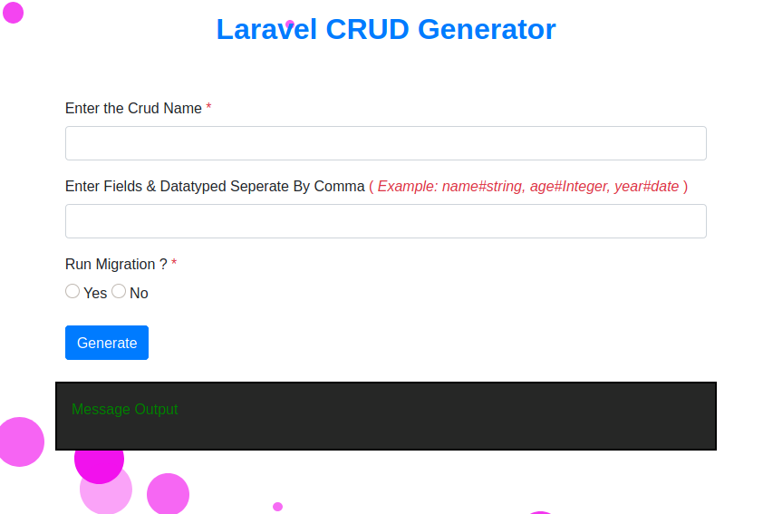

# Laravel CRUD Generator

This package provides a super easy way to make a laravel crud opration.

## Features
* It Creates a Model with all feilds validation
* It Creates a Migration Table with table fields provided by users.
* It Runs the migration of specific table .
* It Creates resource controller with all functionallity .
* It Creates view files Index.blade.php, Create.blade.php, show.blade.php, edit.blade.php .
* It Can work with both existing and new project .
* Laravel 7.x and higher
* PHP 7.0 and higher.


## Support

We proudly support the community by developing Laravel packages and giving them away for free. Keeping track of issues and pull requests takes time, but we're happy to help!

## Installation

You can install the package via composer:

```bash

composer require kaushalmaurya/crud

```

Add the Service Provider  to your ```app.php``` config file if you're not using Package Discovery.

```php

// config/app.php

'providers' => [
    ...

    Kaushalmaurya\Crud\CrudServiceProvider::class,
    ...
];


```
## Exicution
* Connect to a database
* Run the server 
* Type in the url [127.0.0.1:8000/crud]
* And you will get this below interface .




## License

The MIT License (MIT). 